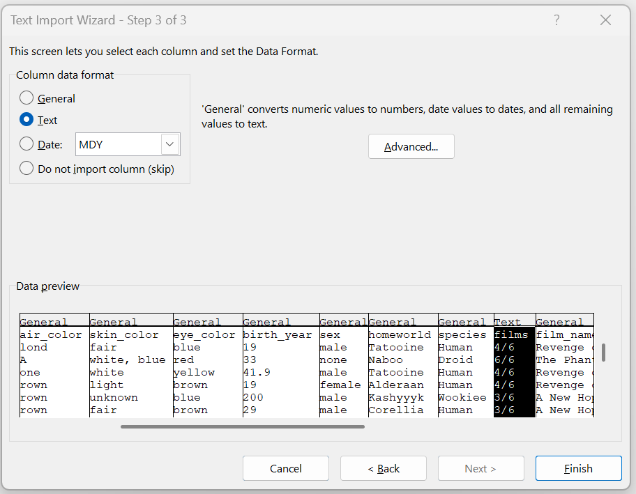
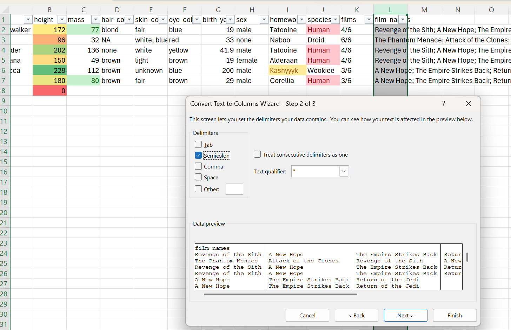

# Excel Tips and Tricks
This exercise will teach you a few of the most useful tips for data manipulation and cleaning in Excel. 

## ⤵️Step 1: Importing Data
One of the most annoying and detrimental features of Excel is how much it **loves** to convert data, especially fractions (➗), into dates (📅).

I've saved our test dataset as a `.txt` file to illustrate this.

### 1.1 Download [raw_star_wars.txt](data/raw_star_wars.txt).

Open Excel, select Open 📂, then Browse 📂 and navigate to your Downloads folder.

You will see something that looks like this, and you will ask yourself, "Where is the file that I literally just downloaded?"

You will then go to the dropdown in the bottom right and change it from "All Excel Files" to "All Files"

There it is! 

### 1.2 Import raw_star_wars.txt
Select the file and click Open. 

You'll see an Import Wizard 🪄

#### 1.2.1 Use the defaults for Step 1
The file is Delimited (not Fixed Width).

You *can* check "My data has headers."

#### 1.2.2 Use the defaults for Step 2
We can see now that the file is **Tab**-delimited because the columns are correctly separated when we select **Tab** as the delimiter. 

To prove this, try unchecking **Tab** and selecting one of the other delimiters. 

#### 1.2.3 What happens if we use the defaults for Step 3
I've made a column called `films` with how many films a character has appeared in, out of the original and prequel trilogies.

So Luke Skywalker (who technically appears as a baby in Revenge of the Sith, in addition to all the original movies) is in 4/6 films. 

But Excel has decided that 4/6 = April 6th, 2025:

#### 1.2.4 What to do instead for Step 3
You can see that the default for Column data format is **General**, which automatically converts "date values to dates." 

You might say, why would it assume that 4/6 is a date and not a fraction? To which I say, great question, I have no idea why this is the default. 

The fix is to select the `films` column and change it from **General** to **Text**.

Cells formatted as **Text** are displayed exactly as written.

So select **Text** on Step 3 of the Import Wizard and click Finish.

## 🎨Step 2: Conditional Formatting
There's a lot of fancy stuff you can do with conditional formatting, but I'll teach you the basics.

### 2.1 Highlight Duplicates
Highlight column J, `species`, and select the following Conditional Formatting options:

A useful real-world example is gene expression analysis, where you have two lists of differentially expressed genes and you want to quickly see the overlap. Paste one gene list below the other (separated by a cell) and highlight duplicates.

### 2.2 Highlight Text that contains...
Highlight column I, `homeworld`, select the following Conditional Formatting options, and then type `Kashyyyk` for Chewie's homeworld:

Useful if you have specific text that you want to quickly highlight.

### 2.3 Highlight Values
Highlight column C, `mass`, select the following Conditional Formatting options, and select a range of values:

As you can see, you can also select values >, <, or = specific values. Useful to see only significant p-values.

### 2.4 Color Scales
Highlight column B, `height`, select the following Conditional Formatting options, and pick a color pallette:

💡Note that the top and bottom of the scales are determined by the largest and smallest values in your data, respectively. 

Look how the colors change if I include `0`:

Mostly useful to get a visual sense of the distribution of your data (and it looks pretty). 

## 🗃️Step 3: Filtering
Click on any cell in row 1 and follow the steps below, either on the **Home** tab (left image) or the **Data** tab (right image):

Select the dropdown arrow 🔽 in column H, `sex`, to filter for only the male characters:

Filtering is an incredibly powerful tool, but it can also be dangerous, especially when filtering multiple variables at the same time. 

Make sure you are always aware of what filters you have on at any given time to make sure you're not inadvertently missing any data. 

## 📊Step 4: Text to Columns
I've listed the names of the films the characters appear in, separated by a semicolon `;`.

If we want to separate out each film into its own cell, we can use the Text to Columns feature.

### 4.1 Text to Columns Wizard
#### 4.1.1 Open Text to Columns Wizard 🪄
Unfilter column H (select the dropdown 🔽 and select "Clear filter from `sex`").

Select column L, `film_names`, and select Text to Columns

#### 4.1.2 Make sure you select "Delimited" in Step 1
This will look the same as Step 1 of our Data Import Wizard.

#### 4.1.3 Select the appropriate delimiter in Step 2
I separated the films by `;`, so select **Semicolon** under Delimiters:

#### 4.1.4 Use the defaults for Step 3
We don't need to change the column data format.

### 4.2 Important Caveats
#### 4.2.1 Column names
You'll notice that our filter only applies to the original `film_names` column. 

It's best to create column headers for each new column we just created.
* If we don't care what they're called, we can mark them with anything (I just use an `x`).
* In this case, I wrote them in order, so the first film listed is the first film the character appears in, and so on.
* So we can name the new columns logically, with `first_film`, `second_film`, etc.

#### 4.2.2 Filtering with empty columns
A helpful way to identify missing data in a dataset is to filter by `(Blanks)`. 

You will need to *reapply* the filter to the newly named columns. Just click **Filter** again.

Select the filtering dropdown 🔽 in column Q, our newly named `sixth_film` column, and filter by `(Blanks)`:

Now we can see which characters do not appear in a sixth film. If we want, we could add `NA` to these blank spaces to indicate that the `sixth_film` variable does not apply to these characters. 

#### 4.2.3 ⚠️ The most important thing about Text to Columns
In an attempt to be helpful, Excel assumes you want to apply your Text to Columns settings to every Excel file you open until you tell it otherwise.

This can cause some very annoying behaviors, especially if your delimiter was something very common, like **Tab** or **Space**, because it will automatically turn text into columns using that delimiter.

Re-set to the defaults by selecting a cell with text, going back to Text to Columns, and unchecking whatever delimiter you used. 

For us, we will uncheck **Semicolon**:

## 📑Step 5: Tabs
Sometimes you need to create an Excel workbook with multiple tabs. This can sometimes keep things organized, but there are a few important things to note regarding tabs and data cleaning.

First, if you don't know how to create one, go to the bottom left corner and click the ➕:

1. It's always good to rename your tabs so you know what is in them and why you created them. Right click and select **Rename**.
2. Most data analysis programs such as R *cannot process multiple tabs within a file*. They will default to reading the first tab of a workbook.
3. This is also true of different file formats. You cannot have a document with multiple tabs if you save it as a `.txt`, `.csv`, or `.tsv` file, for example.
4. If you need to save your data in one of those formats, or if you need to analyze multiple tabs in R, save each tab as a separate Excel file. 

## 💾Step 6: Save as Excel `.xlsx`
This might not deserve its own step, but I can't count how many times I've created a beautiful Excel with lots of conditional formatting and a bunch of tabs, only to not realize that it was still a `.csv` file or something, and saved it without realizing it, losing all my tabs and formatting. 

This has become a bigger issue now that Microsoft Office makes file extensions more difficult to see. (You used to be able to check the file extension at the top of your Excel window, but now it just shows the file name.)

The safest thing to do is to save your file as an Excel `.xlsx` file as soon as you've imported it. 

Do I always remember to do this? No. Should I? Yes. 

Save your workbook, using **💾 Save As**, now. To differentiate it from our raw data, which we should never overwrite, save it with a name like `clean_star_wars.xlsx`.

## 🔀Step 7: Transposing your Data
Sometimes you need to transpose your data so the columns are rows and the rows are columns. 

To illustrate this, I've saved another dataset, [star_wars_homeworlds.xlsx](data/star_wars_homeworlds.xlsx), which you can download now.

I've saved this as an `.xlsx` file, so you don't need to worry about importing it; just open it in Excel. 

We're going to learn a few things using this dataset, so let's transpose it to be more user-friendly.

Copy the entire range we want to transpose (including the blank spaces), select a blank cell, and select the **Transpose** Paste Option:

