# Excel Tips and Tricks
This exercise will teach you a few of the most useful tips for data manipulation and cleaning in Excel. 

## ⤵️Step 1: Importing Data
One of the most annoying and detrimental features of Excel is how much it **loves** to convert data, especially fractions (➗), into dates (📅).

I've saved our test dataset as a `.txt` file to illustrate this.

### 1.1 Download Test Dataset
Download [raw_star_wars.txt](data/raw_star_wars.txt).

Open Excel -> Open 📂 -> Browse 📂 and navigate to your Downloads folder.

To find our file, go to the dropdown in the bottom right and change it from "All Excel Files" to "All Files":

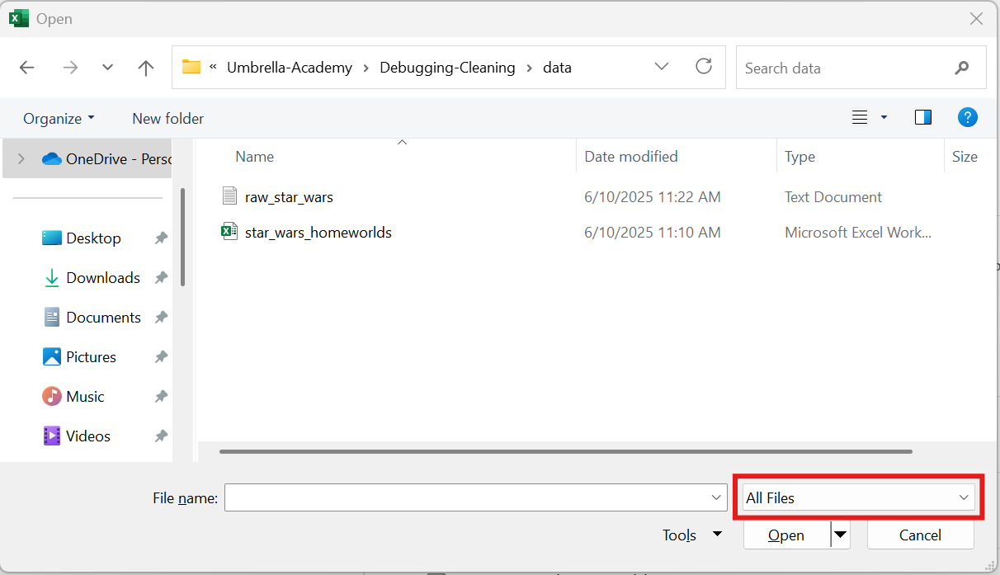

### 1.2 Use the Import Wizard 🪄
Select the file and click Open. 

#### 1.2.1 Use the defaults for Step 1
The file is delimited, with headers, so choose "Delimited" and check "My data has headers."

#### 1.2.2 Use the defaults for Step 2
The columns are correctly separated when **Tab** is the delimiter. 

(Try unchecking **Tab** and selecting another delimiter to test this.)

#### 1.2.3 What happens if we use the defaults for Step 3?
I've created a column called `films` indicating the number of films a character has appeared in (of the original and prequel trilogies).

Luke Skywalker, for example, is in 4 of 6 films.*  
**(He technically appears as a baby in Revenge of the Sith, plus all the original films)*

But Excel has decided that 4/6 = April 6th, 2025:

#### 1.2.4 What to do instead for Step 3
The default data format is **General**, which automatically converts "date values to dates." 

Why does it assume 4/6 is a date and not a fraction? Great question, I have no idea why this is the default. 

Instead, select the `films` column, change it to **Text**, and click Finish.

Cells formatted as **Text** are displayed exactly as written.

## 🎨Step 2: Conditional Formatting
There's a lot of fancy stuff you can do with conditional formatting, but I'll teach you the basics.

We'll use the **Conditional Formatting** button on the Home tab.

### 2.1 Highlight Duplicates
Highlight column J, `species`, and select the following Conditional Formatting options:

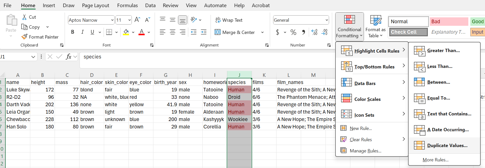

To clear this (or any other conditional formatting), just select the **🧽Clear rules** button.

#### 🌍Real-world usage: Gene expression analysis  
You have two lists of differentially expressed genes, and you want to quickly see the overlap.  
Paste one gene list below the other (separated by a cell) and highlight duplicates.

### 2.2 Highlight Text that contains...
Highlight column I, `homeworld`, select the following Conditional Formatting options, and then type `Kashyyyk` for Chewie's homeworld:

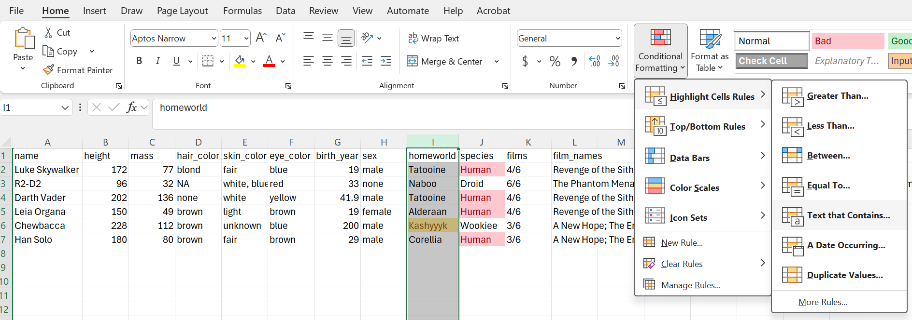

#### 🌍Real-world usage: Reviewing `TRUE`/`FALSE` statements  
You have a logical variable and want to scan for any `FALSE` statements.  
Color-code text that contains `FALSE` to spot it at a glance.

### 2.3 Highlight Values
Highlight column C, `mass`, select the following Conditional Formatting options, and select a range of values:

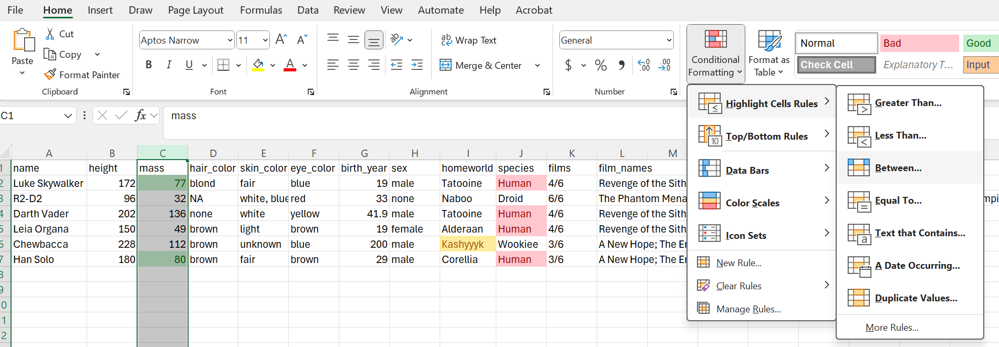

As you can see, you can also select values >, <, or = specific values.

#### 🌍Real-world usage: Identifying significant p-values  
Highlight only p-values <= 0.05.

### 2.4 Color Scales
Highlight column B, `height`, select the following Conditional Formatting options, and pick a color pallette:

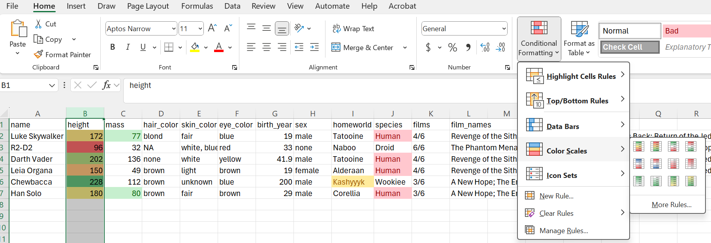

Note that the top and bottom of the scales are determined by the largest and smallest values in your data, respectively. 

Look how the colors change if I include `0`:

#### 🌍Real-world usage: Evaluate distribution of a continuous variable  
Mostly useful to get a visual sense of the distribution of your data (and it looks pretty). 

### ⚠️A Caveat on Formatting in Excel
**Conditional Formatting** can help ensure data integrity by helping identify duplicates, errors, and inconsistencies. It can also assist in evaluating data distributions and patterns.

**Manual Formatting**, such as color-coding relevant variables or samples, should be avoided.  
Color-coding can quickly become difficult for others to interpret, or you may forget what a certain color signifies. 

If there is meaningful information you want to retain, you should encode it as a variable. 

## 🗃️Step 3: Filtering
Click on any cell in row 1 and follow the steps below, either on the **Home** tab (left image) or the **Data** tab (right image):

Select the dropdown arrow 🔽 in column H, `sex`, to filter for only the male characters:

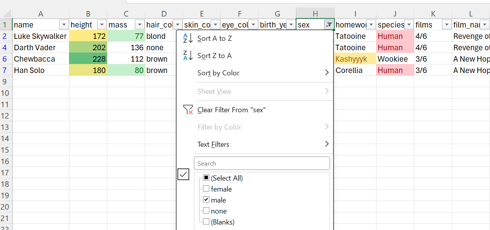

> 💡Tip: You can also filter by colors.

Filtering is powerful, but it can also be dangerous, especially when filtering multiple variables at once. 

Be mindful of active filters to avoid inadvertently missing any data.

#### 🌍Real-world usage: Evaluate duplicates  
Here's an example of Conditional Formatting and Filtering working nicely together:
* Highlight all duplicates and then filter based on the highlight color
* You can look at only the duplicated values, which makes evaluating them easier

## 📊Step 4: Text to Columns
In `film_names`, I've listed each character's films, separated by a semicolon, `;`.

If we want to separate each film into its own cell, we can use **Text to Columns**.

### 4.1 Use the Text to Columns Wizard 🪄
Unfilter column H (select the dropdown 🔽 and select "Clear filter from `sex`").

Select column L, `film_names`, and select **Text to Columns**

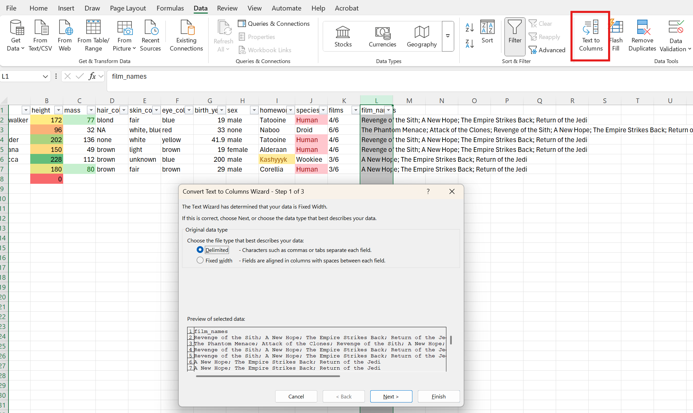

#### 4.1.1 Select "Delimited" in Step 1
This will look the same as Step 1 of our Data Import Wizard.

#### 4.1.2 Select the appropriate delimiter in Step 2
Select **Semicolon** under Delimiters:

#### 4.1.3 Use the defaults for Step 3
We don't need to change the column data format.

#### 🌍Real-world usage: Gene Ontology analysis  
Individual genes in gene ontology (GO) results tables are often separated by a delimiter like `;`.  
For subsequent analyses, it's helpful to split them into separate columns. 

### 4.2 Important Notes on Text to Columns
#### 4.2.1 Column names
It's best to create headers for each new column we just created.
* In this case, the first film listed is the first film the character appears in, and so on.
* We can name the new columns logically, with `first_film`, `second_film`, etc.
* This helps with subsequent filtering, which we will do in the next step.

#### 4.2.2 Filtering by `(Blanks)`
Often, **Text to Columns** will generate columns with no entries for certain variables. 

In this case, we have many characters who don't appear in 6/6 films, so have no entries under e.g. `sixth_film`.

A helpful way to identify missing data in a dataset is to filter by `(Blanks)`. 

You will need to *reapply* the filter to the newly named columns. Just click **Filter** again.

Select the filtering dropdown 🔽 in column Q, our newly named `sixth_film` column, and filter by `(Blanks)`:

Now we can see which characters do not appear in a sixth film. 

If we want, we could add `NA` to these blank spaces to indicate that the `sixth_film` variable does not apply to these characters. 

### 4.3 ⚠️ The most important thing about Text to Columns
In an attempt to be helpful, Excel assumes you want to apply your **Text to Columns** settings to every Excel file you open until you tell it otherwise.

This can cause some very annoying behaviors, especially if your delimiter was something common, like **Tab** or **Space**, because it will automatically turn text into columns using that delimiter.

After you've applied **Text to Columns**, reset it to the defaults by selecting a cell with text, going back to **Text to Columns**, and unchecking whatever delimiter you used:

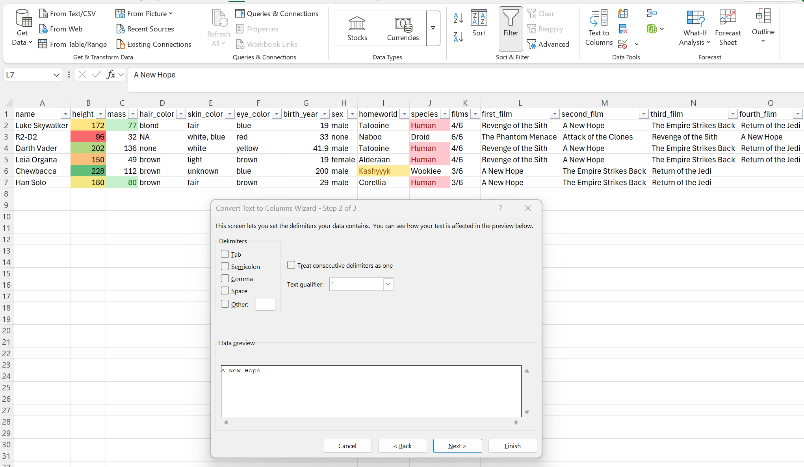

## 📑Step 5: Tabs
Sometimes you need to create an Excel workbook with multiple tabs. 

This can keep things organized, but there are a few important things to note regarding tabs and data cleaning.

First, to create a new tab, go to the bottom left corner and click ➕:

Notes on Tabs:
1. It's always good to rename your tabs so you know what is in them and why you created them. Right-click the tab and select **Rename**.
2. Most data analysis programs such as R *cannot process multiple tabs within a file*. They will default to reading the first tab of a workbook.
3. File formats like `.txt`, `.csv`, and `.tsv` do not support multiple tabs.
4. If you need to save your data in one of those formats, or if you need to analyze multiple tabs in R, save each tab as a separate Excel file. 

## 💾Step 6: Save as Excel `.xlsx`
I can't count how many times I've created a beautiful Excel with lots of conditional formatting and many tabs, only to forget that it was still a `.csv` file or something, and saved it without realizing it, losing all my tabs and formatting. 

This has become a bigger issue now that Microsoft Office makes file extensions more difficult to see. (You used to be able to check the file extension at the top of your Excel window, but now it just shows the file name.)

The safest thing to do is to save your file as an Excel `.xlsx` file as soon as you've imported it. 

Save your workbook, using **💾 Save As**, now. To differentiate it from our raw data, which we should never overwrite, save it with a name like `clean_star_wars.xlsx`.

## 🔀Step 7: Transposing your Data
Sometimes you need to transpose your data so the columns are rows and the rows are columns. 

To illustrate this, I've created another dataset, [star_wars_homeworlds.xlsx](data/star_wars_homeworlds.xlsx).

### 7.1 Download `star_wars_homeworlds.xlsx`

I've saved this as an `.xlsx` file, so you don't need to worry about importing it; just open it in Excel. 

We're going to learn a few things using this dataset, so let's transpose it to be more user-friendly.

### 7.2 Transpose
Copy the entire range we want to transpose (including the blank spaces), select a blank cell, right click, and select the **Transpose** Paste Option:

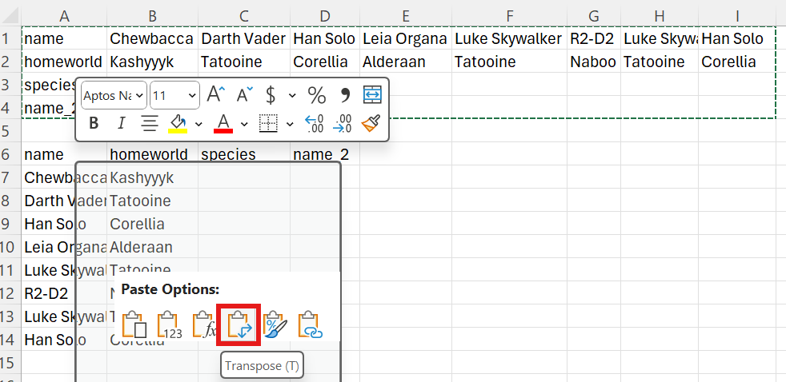

### 7.3 Delete un-transposed data
Let's delete the un-transposed data, so that the `name` column header is now in cell A1. 

The easiest way to do that is to select rows 1-5, right click, and delete:

## 👥Step 8: Remove Duplicates
Under the Data tab, there's a useful feature called **Remove Duplicates**. 

As with filtering, however, *this tool can be very dangerous.*

Here's where **Highlight Duplicates** can be helpful:

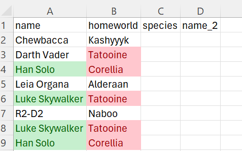

I've copied a few records, so there are a few true duplicates in both `name` and `homeworld`. 

However, both Darth Vader and Luke Skywalker have Tatooine as their homeworld. 

If we removed duplicates from the `homeworld` column *only*, it would keep the first instance and drop the rest. It would correctly remove the duplicated Han and Luke entries, but it would also drop Luke entirely. 

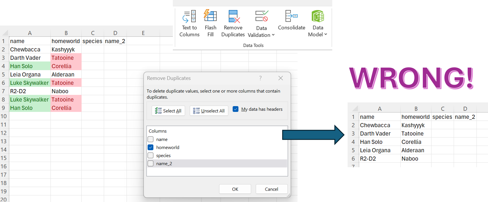

The correct way would be to either select only the `name` column, or to select all columns, which will evaluate for duplicate entries across full rows (i.e. all column values must be duplicated across a row).

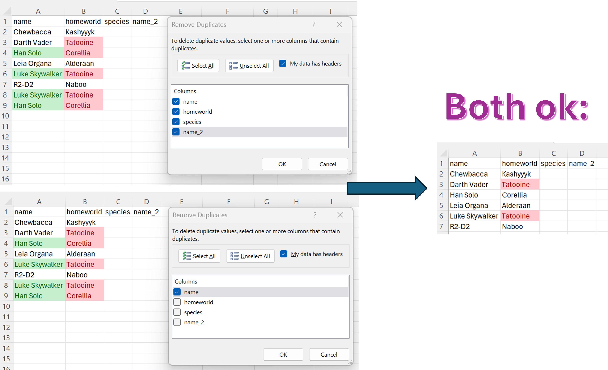

## 🔎Step 9: `VLOOKUP`
I'm  not exaggerating when I say my life changed dramatically (for the better) once I finally learned how to write a `VLOOKUP`. 

You'll notice that we have blank columns for `species` and a column I've called `name_2`. 

Using a `VLOOKUP`, we can match the unique `name` variable in `star_wars_homeworlds.xlsx` and `clean_star_wars.xlsx` to automatically populate the empty `species` and `name_2` columns. 

### 9.1 Writing a `VLOOKUP`
I say "writing," but I always use Excel's "Insert Function" tool.

#### 9.1.1 Insert the `VLOOKUP` function
Select the first blank cell we want to populate, C2. 

Click the function button: *fx*

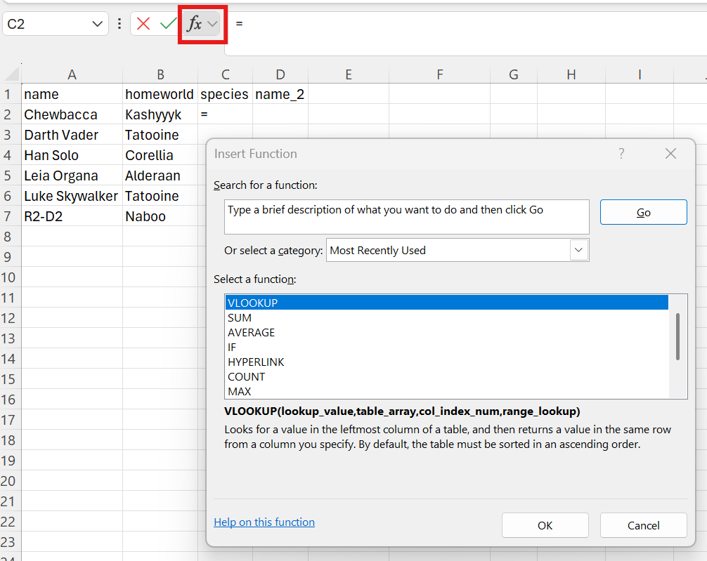

`VLOOKUP` is my most-used function, but you will have to search for it in the search box. 

Let's walk through how to populate each of the arguments in the `VLOOKUP` function:

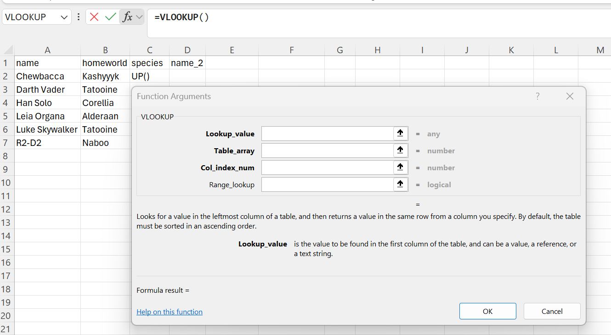

#### 9.1.2 Lookup_value
This is the unique key that you will use to match the data in your current sheet with the source data.

We will use `name`. Since we are filling out the `VLOOKUP` for cell C2, we want to select the corresponding name in A2.

You can type "A2" or you can select the ⬆️ arrow next to **Lookup_value** and then click cell A2.

We will write this whole `VLOOKUP` function for cell C2, but I'll show you how to apply it to the rest of the empty cells. 

#### 9.1.3 Table_array
This is where the `VLOOKUP` is looking. Here we provide the range of data that includes both the unique key (here `name`) and the column containing the missing data we want to populate. 

Don't worry if you include extra data in this step; we will specify exactly where to look later. 

The only requirement is that the unique key is in the **first column** of this array. This is how the `VLOOKUP` knows where our unique key is in the other dataset. 

To complete this, we should definitely select the ⬆️ and then move to the `clean_star_wars.xlsx` workbook. We will select from A1 through J7.

You'll notice that **Table_array** has now been populated with `[clean_star_wars.xlsx]clean_star_wars!$A$1:$J$7`.

This is how Excel knows which workbook to look in (here `clean_star_wars.xlsx`) for the data.

#### 9.1.4 Col_index_num
This is where we specify the column we want to pull the data from; we tell it the specific *column* (col) *index number* (index_num).

Note that this is **in relation to the array from the previous step.**

If you started your **Table_array** on column Y of a spreadsheet, and wanted the data in column Z, you would write `2` because Z is the 2nd column in the array you provided, even though it's the 26th column in the overall spreadsheet. 

For us, `species` is in column 10 of our spreadsheet and our array from A1-J7, so we will write 10 here. 

#### 9.1.5 Range_lookup
This asks if you want an exact match to your unique key or an approximation.

`TRUE` gives an approximation, `FALSE` gives an exact match. 

I always use `FALSE` to be safe.

#### 9.1.6 Admire your work (and run your function)
Here is our beautiful `VLOOKUP` function!

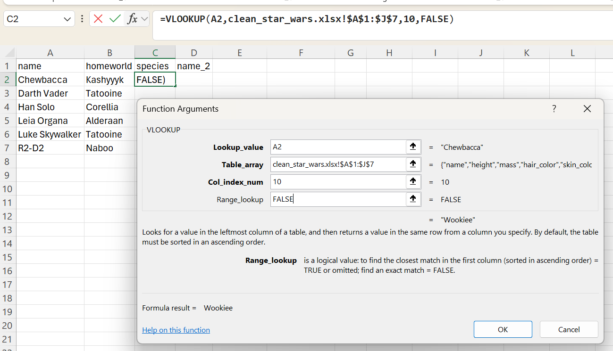

You can see it previews the answer it will return -- and ours correctly says `= Wookiee`. Hit Ok to apply it to the cell. 

### 9.2 Applying a VLOOKUP to a range
Ok, phew, we wrote that whole `VLOOKUP` statement...just for cell C2. 

Please don't tell me I need to do that every time for every cell! (You may be saying)

Don't worry! I will show you how to apply it to the rest of your data. 

#### 9.2.1 Holding the name constant
You may have wondered about the `$` in the **Table_array** argument. 

A `$` tells Excel to hold something constant. When our **Table_array** said `$A$1:$J$7`, it means to always look from A1 to J7. It's keeping the range of data constant. 

We can do the same for our **Lookup_value**. In this row, A2 will always be our unique key, so we want to tell Excel that our **Lookup_value** should always be A2. 

But! We're going to apply our `VLOOKUP` to the other names in our spreadsheet, so we don't want to fix both the column *and* the row (`$A$2`), because then it would only ever return the result for the name value in A2 (`Chewbacca`).

We want to fix the name column, but allow the row to change, so we will change our **Lookup_value** to `$A2`.

Now, we can click the tiny square in the bottom right corner of cell C2 and drag it so that the `VLOOKUP` populates cells C2 to C7:

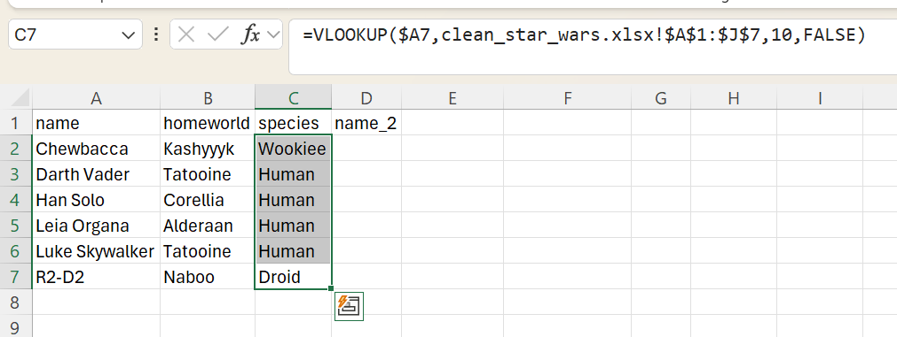

The **Lookup_value** should automatically update to correspond to each row in column A.

#### 9.2.2 Finding additional variables
We wrote all that to get `species`, but I also have this mysterious `name_2` column (the reason for this will become clear soon). 

Now that we've fixed `$A2`, we can also change the **Col_index_num** to pull data from a different column that still matches the unique ID we defined. 

Let's get the name from `clean_star_wars.xlsx` by changing the **Col_index_num** to `1`, and applying this function to all the empty cells:

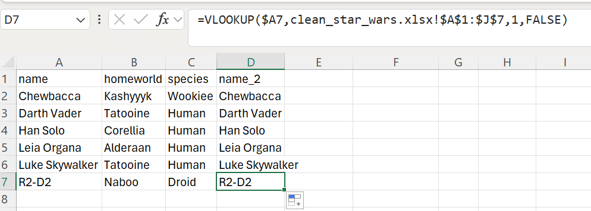

### 9.3 Important `VLOOKUP` caveats
A few important things to note about `VLOOKUP`
* If data isn't returned from a `VLOOKUP`, it doesn't necessarily mean it doesn't exist.
  * If the `VLOOKUP` can't find what you asked for, it will return `#N/A`.
  * That doesn't *always* mean that there's no matching data. It could be a few things:
    * There is a typo in the unique ID in one of the datasets
    * You didn't request the correct **Table_array** range
    * There may not be a typo, but the data may be stored in different forms, e.g. text in one document and numeric in another
  * In other words, be a bit skeptical of an `#N/A` and look more closely at those entries to ensure there is really no match
* If there are multiple entries for the same unique key, **`VLOOKUP` will report the first column value it finds**
  * This is especially important for e.g. time series data, where you may have multiple rows corresponding to the same individual with different observation timepoints.
  * This is called "long data" (check out the course Glossary for a more detailed explanation of "wide" vs "long" data).
  * `VLOOKUP`s should therefore not be used on long data, unless you can be certain you are pulling the correct observation.
* It's generally a good idea to convert the value in the cell returned by a `VLOOKUP` from the `VLOOKUP` formula to an exact value.
To do this, copy the range with the `VLOOKUP` formula, and paste it in the same place, using the **Values** Paste option:

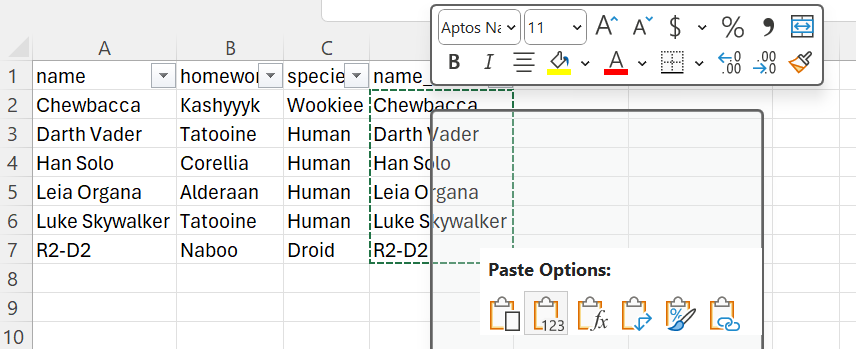

## ➗Step 10: Quick Formulas
I'll close by sharing a few quick and useful formulas for data manipulation and QC. 

### 10.1 Exact Match
Finally, I shall reveal the reason for `name_2`. 

Sometimes it's useful to confirm if the values in one cell are exactly the same as those in another. Let's confirm that for `name` and `name_2`.

I'm using a simple example here because we should be reasonably confident that they match (since this was the key that we used for the `VLOOKUP`). 

**Formula**: `=EXACT(Cell1, Cell2)`

I often use the Conditional Formatting: **Highlight text that contains...** option to turn `TRUE` green and `FALSE` red, so I can see at a glance if there are problems. 

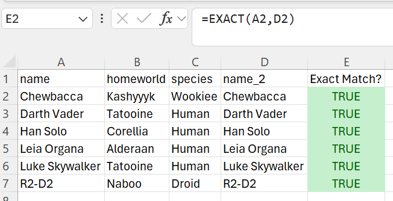

### 10.2 Text Join
We learned about snake_case (check out the Glossary for the definition) in programming and analysis. 

Here's an easy way to automatically link words using snake_case (or join any two cells with a linker in the middle). 

**Formula**: `=TEXTJOIN("delimiter",ignore empty cells?,Cell1,Cell2, ...)`

## 🙌Summary
By now, you should be able to do some basic data manipulation and cleaning in Excel. 

You've learned how to:
* Import a file, without Excel assuming every fraction is a date, using the Import Wizard
* Apply some neat Conditional Formatting to evaluate, filter, and clean your data
* Turn text, separated by a delimiter, into columns using Text to Columns
* Use workbook tabs (and when you might not want to use them)
* Save your files in `.xlsx` format to maintain your formatting and tabs
* Transpose your data
* Carefully remove duplicate values
* Write a `VLOOKUP` formula (!), plus some other key formulas for data cleaning

### Reference
I've saved my version of both final cleaned datasets in the [data/cleaned_data](data/clean_data) folder. 

This way, you can see the exact conditional formatting I applied and reference the full `VLOOKUP`, `EXACT`, and `TEXTJOIN` formulas.

Happy cleaning! 🧽🧼🫧
